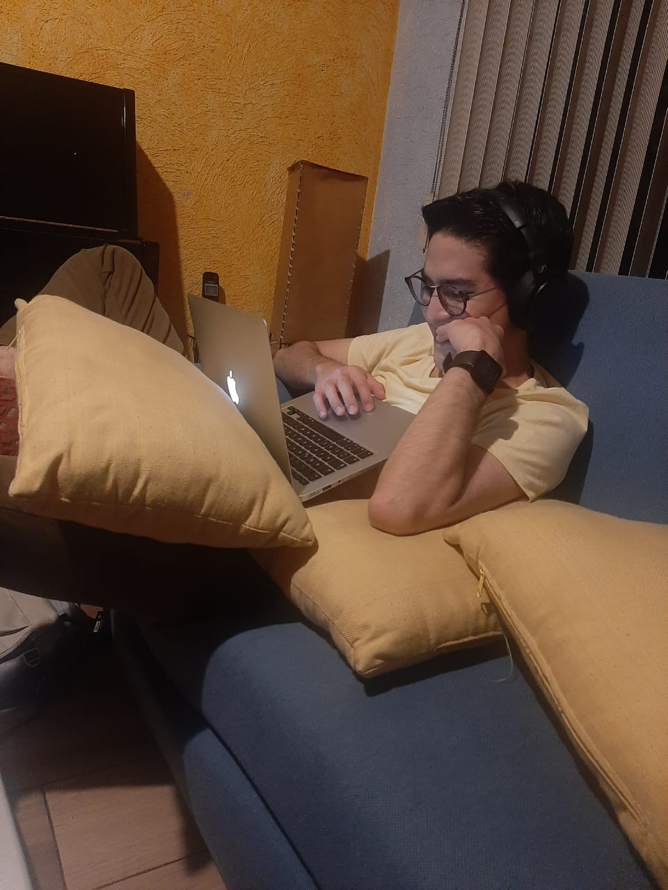

# Alfredo Varela Vega 

## _Nice to meet you!_

---

### My vision

As a Bioinformatician with a B.Sc. in Genomic Sciences from the National Autonomous University of Mexico (UNAM), my goal is to transcend the boundaries across diverse data modalities, including omics technologies, electronic health records, wearable biosensors, biomedical literature, and environmental information. My mission is to reshape the frontiers of personalized healthcare by integrating and interpreting this wealth of data. In my pursuit, I envision contributing to a new era of healthcare that elevates the quality of life for each unique individual.

--- 

### My tools 

To generate meaningful insights from complex datasets I utilize <u>Python for data exploration, visualization and preparation</u> using libraries such as pandas, NumPy, Pyplot, Plotly, seaborn, and Biopython. Additionally, my knowledge of R for data exploration, visualization, statistical analysis, and modeling , including the use of tidyverse, ggplot, base R, Bioconductor, and Rmarkdown, allows me to perform comprehensive analyses of genomic and health data. 

I also specialize in *machine learning techniques*, utilizing scikit-learn for feature selection, classification, clustering, and handling unbalanced data, as well as deep learning frameworks such as Pytorch-lightning, Mindspore, Transformers, and WandB which enable me to create my predictive analysis. 
 
Furthermore, I have experience with high throughput analysis methodologies, including sequence quality and filtering using tools like FastQC and Trimmomatic, genome assembly with Velvet, canu, and SPades, and prediction and functional annotation with Glimmer3 and Prokka. 

--- 

### Hobbies

In my spare time I love to analyze all kind of interesting datasets. Particularly, I'm interested in sports data due to my undeniable passion for them. 

> Isn't it spectacular how the perspective of the game changes under the sports analytics lens?

Apart from sports & data science, I love reading, [coffee brewing](https://twitter.com/fikandatautoma), exploring my sense of smell, running, practicing Muay Thai and fresstyle slalom skating.

---

### Fun facts 

> Muchos años después, frente al pelotón de fusilamiento, el coronel Aureliano Buendía habría de recordar aquella tarde remota en la que su padre lo llevó a conocer el hielo. - Gabriel García Márquez.

- The quote comes from my favorite book: "Cien años de Soledad" written by Gabriel García Márquez.
- My favorite scent is [Pinot Noir](https://www.winemag.com/2019/08/13/the-essential-guide-to-pinot-noir/). 
- My favorite [coffee brewing method](https://www.youtube.com/watch?v=vQVTNscQY0c) is the Hario V60. 
- My fastest 5k is **23.22.6**. 

<iframe src='https://connect.garmin.com/modern/activity/embed/4430430469' title='Coyoacán Running' width='465' height='500' frameborder='0'></iframe>

